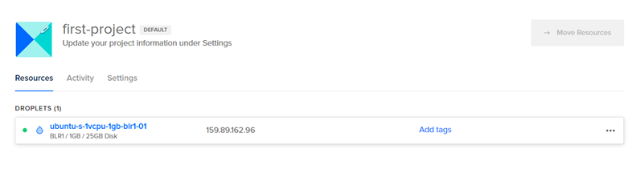

Setup server on DigitalOcean:

To Create Droplets (Cloud Servers) in Digital Ocean : https://cloud.digitalocean.com/
•	Click CREATE -> Select Droplets
•	Choose region which is near to your Geo location -> Bangalore
•	Choose an image -> Ubuntu
•	Version -> 23.10 x 64
•	Choose Size -> Droplet Type: Shared CPU
•	CPU Options: REGULAR Disk Type: SSD
•	Choose Authentication Method -> SSH Key (Recommended) as we are going to establish connection between our local machine and cloud server
o	Command to generate SSH key on Windows: ssh-keygen -t rsa -b 4096 -C your_email@example.com
•	Click Create Droplet. Droplet will be created as shown below:

•	The ipv4: 159.89.162.96 in the Droplet is the Public IP address of the server

•	In the Digital Ocean, when we create a server, it is publicly accessible on all ports. By default server is not protected. So basically, it is not protected by Firewall, this is a bad security practice.
•	Configure Firewall to protect server and using Firewall configs we will explicitly allow public access to specific ports that we want to expose like web server, ssh port and so on.
o	Configure Firewall = Closing access by default
o	Selectively open the ports which we need
•	In order to connect to server, we are going to need SSH into it. And the SSH port is 22 and which means we have to allow access to our Ubuntu server on port 22, so that we can SSH into it.

What is SSH?
SSH stands for Secure Shell. It's a cryptographic network protocol used to establish a secure connection between a client and a server over an unsecured network. SSH provides a secure channel over an insecure network by encrypting the data exchanged between the two parties, thus protecting it from eavesdropping, interception, and tampering.
Configure Firewall rules for the Droplets:
•	Go to the respective Droplets Networking menu/ Go to networking in the left side menu outside the droplet
•	Firewall is for all of DigitalOcean.
•	Click Create Firewall
•	By default, in the Inbound rules, it gives the port range as 22 and sources as all IPv4, all IPv6

•	Change the Source value to your PC IP Address because we need to configure only our PC IP or rang of Ips. IP addresses are dynamic, so whenever you restart your PC, the IP address will change, so update it accordingly in the Firewall config
o	Use this link to find your IP: https://whatismyipaddress.com/
•	Leave the Outbound rule to default values
•	Then, click create firewall

•	Next, assign the droplets to the Firewall rule which we configured.

•	Inbound -> On which port does our droplet allow connections.
•	Outbound -> To which destination our droplet/server actually talk to. So this is opening our droplet to internet because obviously we need to download Java and Docker and install them. So it needs internet connection

Establish connection between your local machine (PC) and remote host (Server):
•	Copy the IP address of the droplet: ipv4: 159.89.162.96

•	Go to terminal and run this command “ssh root@159.89.162.96”
•	Now we’re on our Ubuntu Server

•	Now the state of the machine is completely clean, we can install applications like java, docker etc,.
Install Java on Droplet:
•	Run: apt update
•	Run: apt install openjdk-8-jre-headless
Deploy and run application artifact on Droplet:
Next, we are going to perform the below operations:
1.	Build Jar file locally
2.	Copy to remote server
3.	Run App on the remote server

1.	Build Jar file locally:
      •	Clone the project: https://github.com/Dinesh-DevOps55/cloud-iaas-basics
      •	Since this is a Gradle project, we are going to build Gradle
      •	Run the command: “gradle build”, as a result build folder will be created and build will be successful

•	Inside the build -> libs folder, there are jar files. Now we need to run this JAR files in Ubuntu server on Digital Ocean.

•	To run jar files on ubuntu server on Digital ocean:
o	Run the command “scp build/libs/cloud-iaas-basics.jar root@159.89.162.96:/root”
o	Scp = secure copy
o	build/libs/cloud-iaas-basics.jar = jar file path
o	root@159.89.162.96 = Droplet IP address
o	:/root = Path where this Jar file end up.
Output:

•	Now go new terminal
o	Connect your local machine to remote server: ssh root@159.89.162.96

•	Run ls command to list the files present in the droplet. As a result you will see the jar file which is uploaded to droplet from your local machine.

•	Since we have already installed java on the droplet, we can execute Java commands
•	Run the command: java -jar cloud-iaas-basics.jar
Now, the application is started and it’s listening to the Tomcat server port: 7071

•	Next, we need to access this application from web server. We have public IP address, however we don’t port opened to access the application. So add this port in the firewall rule.
•	Add custom firewall rule in the Inbound rule

•	Now access the application from web browser using the droplet IP and the port
159.89.162.96:7071

After opening the application in browser, go to server terminal, here you can find GET/Countries ,meaning we are fetching the countries details in the web server.

sudo netstat -tuln | grep 7071

‘netstat is a command-line tool used for displaying network connections, routing tables, interface statistics, masquerade connections, and multicast memberships

java -jar cloud-iaas-basics.jar => This command is for attached mode. In attached mode, a process or program is running within a terminal session, and it has a direct connection to the input and output streams of the terminal. The program is actively interacting with the terminal, displaying output in real-time and reading input from the user as needed.

java -jar cloud-iaas-basics.jar & => This command is for detached mode. In detached mode, a process or program is running independently of any terminal session. It is not directly connected to the input and output streams of a terminal. The program runs in the background, without any interaction with the terminal. It may continue running even after the user logs out of the terminal session.

Create and Configure a Linux user on a Cloud Server:
Create a separate Linux User (NOT Root)
Security Best Practices:
As a security best practices, you should not execute services, applications using Root user because with root user you’re providing application the privileges.
•	Create a separate User for every application
•	Give it only the permission it needs to run the App
•	Don’t work with the Root User
Create user in the ubuntu server:
•	Command: adduser dinesh55
As a result, dinesh55 user group has been created and also dinesh55 user has been created.

•	However, I need to allow the user dinesh55 to execute some of the commands that root user can execute. So now we’re going to add this user to sudo group which has root privileges.
•	Command: usermod -aG sudo dinesh55
usermod: This command is used to modify user account properties.
-aG sudo: These options tell usermod to add the user to the specified group(s). -a stands for append (add), and -G specifies the group(s) to which the user will be added. In this case, the user is being added to the sudo group.
•	To switch one user to another, command: su – dinesh55

$: The prompt ending with a dollar sign ($) typically indicates a regular or standard user.
#: The prompt ending with a hash symbol (#) typically indicates the root user or superuser

•	exit command is used to log out from user and also to log out from server.

•	If I try to login to server via the standard user dinesh55, server will deny it. This is because I have to add the SSH key to the standard user dinesh55 like we did for root user.

To add the SSH key to standard user dinesh55:
•	Create .ssh directory in the user dinesh55: mkdir .ssh
•	Add your public SSH key (which was already added in the droplet) in a new file inside the .ssh directory: sudo vim .ssh/authorized_key (Because of ssh we used sudo command)
•	Now login to the server using standard user dinesh55, it will validate the SSH key and allow this user to connect to the server.
We’re going to do the same for every application we install here. For Nexus, we will be creating nexus user and Jenkins, Jenkins user. Even the official document says, we shouldn’t start the application with Root User.
  

 
